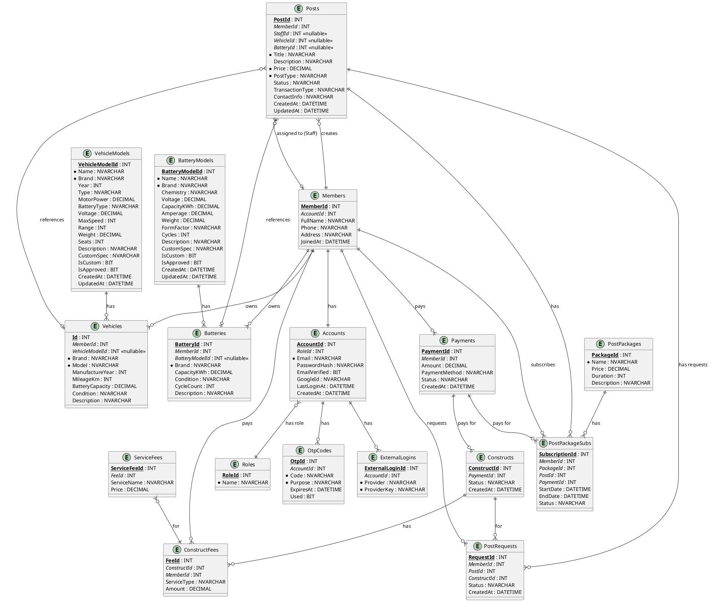

# 📘 EV & Battery Model APIs - Tài Liệu Tổng Hợp

## ⚙️ Cấu hình Base URL

**Port API:** Xem trong `Properties/launchSettings.json` → `applicationUrl` (VD: `http://localhost:5000`)

**Trong tài liệu này:** Thay `{PORT}` bằng port thực tế từ `launchSettings.json`

---

## 📊 Tổng Quan APIs

### APIs Mới (10 endpoints)
- **VehicleModelController:** 5 endpoints (list, detail, custom, filters, search)
- **BatteryModelController:** 5 endpoints (list, detail, custom, filters, search)

### APIs Đã Mở Rộng (1 endpoint)
- **POST `/api/Post`:** Hỗ trợ 3 cách tạo (VehicleModelId, Vehicle object, VehicleId)

### APIs Không Thay Đổi (9 endpoints)
- Tất cả GET/PUT/DELETE trong PostController giữ nguyên, chỉ thêm `.ThenInclude` để load VehicleModel/BatteryModel

---

## 🚗 VehicleModel APIs

### 1. GET `/api/VehicleModel/list` - Danh sách với filter
**Query Parameters:**
- `brand`, `year`, `type`, `minMotorPower`, `maxMotorPower`, `minRange`, `maxRange`, `minSeats`, `maxSeats`
- `isCustom`, `isApproved`, `page` (default: 1), `pageSize` (default: 20)

**Ví dụ:**
```http
GET http://localhost:{PORT}/api/VehicleModel/list?brand=VinFast&type=SUV&year=2023&minRange=200
```

### 2. GET `/api/VehicleModel/{id}` - Chi tiết
```http
GET http://localhost:{PORT}/api/VehicleModel/1
```

### 3. POST `/api/VehicleModel/custom` - Submit model mới
```json
{
  "name": "VF 8 Custom",
  "brand": "VinFast",
  "year": 2024,
  "type": "SUV",
  "motorPower": 300,
  "batteryType": "LFP",
  "voltage": 400,
  "maxSpeed": 180,
  "range": 450,
  "weight": 2200,
  "seats": 7,
  "description": "Mô tả"
}
```
**Response:** Model mới (IsCustom=true, IsApproved=false)

### 4. GET `/api/VehicleModel/all-filters` - Filters cho dropdowns
**Response:**
```json
{
  "brands": ["VinFast", "Tesla", "BYD"],
  "types": ["SUV", "Sedan"],
  "years": [2024, 2023],
  "batteryTypes": ["LFP", "NMC"],
  "motorPower": { "min": 50, "max": 500 },
  "range": { "min": 150, "max": 600 }
}
```

### 5. GET `/api/VehicleModel/search?q={keyword}&limit={limit}` - Search
```http
GET http://localhost:{PORT}/api/VehicleModel/search?q=VF&limit=5
```

---

## 🔋 BatteryModel APIs

### 1. GET `/api/BatteryModel/list` - Danh sách với filter
**Query Parameters:**
- `brand`, `chemistry`, `minVoltage`, `maxVoltage`, `minCapacityKWh`, `maxCapacityKWh`, `minAmperage`, `maxAmperage`
- `formFactor`, `minCycles`, `maxCycles`, `isCustom`, `isApproved`, `page`, `pageSize`

### 2. GET `/api/BatteryModel/{id}` - Chi tiết

### 3. POST `/api/BatteryModel/custom` - Submit model mới
```json
{
  "name": "CATL 100kWh Custom",
  "brand": "CATL",
  "chemistry": "LFP",
  "voltage": 400,
  "capacityKWh": 100,
  "amperage": 250,
  "weight": 650,
  "formFactor": "Prismatic",
  "cycles": 3000,
  "description": "Mô tả"
}
```

### 4. GET `/api/BatteryModel/all-filters` - Filters
**Response:** Brands, chemistries, formFactors, min/max values

### 5. GET `/api/BatteryModel/search?q={keyword}&limit={limit}` - Search

---

## 📝 Post APIs với Model Selection

### POST `/api/Post` - Tạo Post (3 cách)

#### Cách 1: VehicleModelId (Tính năng mới - Auto-fill spec)
```json
{
  "memberId": 1,
  "title": "Bán xe VinFast VF 8",
  "description": "Xe mới, còn bảo hành",
  "price": 1200000000,
  "postType": "E-Vehicle",
  "vehicleModelId": 1,
  "vehicleCondition": "Excellent",
  "vehicleMileageKm": 5000
}
```
→ Tự động tạo Vehicle với Brand, Model, Year, Range từ VehicleModel

#### Cách 2: Vehicle/Battery Object (Backward compatible)
```json
{
  "memberId": 1,
  "title": "Bán xe điện",
  "price": 800000000,
  "postType": "E-Vehicle",
  "vehicle": {
    "brand": "Tesla",
    "model": "Model 3",
    "manufactureYear": 2020,
    "mileageKm": 50000,
    "batteryCapacity": 75,
    "condition": "Good"
  }
}
```

#### Cách 3: VehicleId/BatteryId (Backward compatible)
```json
{
  "memberId": 1,
  "title": "Bán xe",
  "price": 1000000000,
  "postType": "E-Vehicle",
  "vehicleId": 1
}
```

### GET `/api/Post/{id}` - Lấy Post
**Response bao gồm:**
- `vehicle.vehicleModel` (nếu có VehicleModelId)
- `battery.batteryModel` (nếu có BatteryModelId)

---

## ✅ Đảm Bảo Không Breaking Changes

### Cam kết
- ✅ **KHÔNG XÓA API NÀO** - 10/10 APIs trong PostController giữ nguyên
- ✅ **KHÔNG THAY ĐỔI SIGNATURE** - Routes, methods giữ nguyên
- ✅ **100% BACKWARD COMPATIBLE** - Hỗ trợ tất cả cách gửi request cũ
- ✅ **CHỈ THÊM DATA** - GET endpoints chỉ thêm VehicleModel/BatteryModel vào response, không xóa data cũ

### Chi tiết thay đổi
- **GET endpoints:** Thêm `.ThenInclude(v => v.VehicleModel)` → Response có thêm data, không breaking
- **POST endpoint:** Đổi param từ `Post` → `CreatePostDto`, nhưng hỗ trợ 3 cách gửi:
  1. VehicleModelId/BatteryModelId (mới)
  2. Vehicle/Battery object (cũ)
  3. VehicleId/BatteryId (cũ)

---

## 🗄️ Database Schema

### Bảng Mới
- **VehicleModels:** VehicleModelId, Name, Brand, Year, Type, MotorPower, BatteryType, Voltage, MaxSpeed, Range, Weight, Seats, Description, CustomSpec, IsCustom, IsApproved
- **BatteryModels:** BatteryModelId, Name, Brand, Chemistry, Voltage, CapacityKWh, Amperage, Weight, FormFactor, Cycles, Description, CustomSpec, IsCustom, IsApproved

### Foreign Keys
- `Vehicles.VehicleModelId` → `VehicleModels.VehicleModelId` (nullable, SET_NULL on delete)
- `Batteries.BatteryModelId` → `BatteryModels.BatteryModelId` (nullable, SET_NULL on delete)

### Columns Mới Trong Posts
- `TransactionType` (nvarchar, default 'DIRECT')
- `StaffId` (int, nullable, FK → Members)
- `ContactInfo` (nvarchar, nullable)

### Database Schema Diagram



**Lưu ý:** Để xem diagram này, cần công cụ hỗ trợ PlantUML (VD: VS Code với extension PlantUML, hoặc online tại http://www.plantuml.com/plantuml/uml/)

---

## 📥 Nhập Data - Hướng Dẫn Team Members

### ⚡ Cách Nhanh Nhất (5 phút)

1. **Mở file:** `DataImport/SimpleInsertScript.sql`
2. **Copy dòng mẫu:**
   ```sql
   ('VF 8', 'VinFast', 2023, 'SUV', 300, 'LFP', 400, 180, 450, 2200, 7, 'Mô tả...', 0, 1, GETDATE()),
   ```
3. **Sửa data:** Thay bằng thông tin model mới
4. **Chạy trong SQL Server Management Studio:** Paste → F5

### 📋 Thông Tin Cần Tìm

**VehicleModels:**
- Name, Brand, Year, Type (SUV/Sedan/Hatchback), MotorPower (kW), BatteryType (LFP/NMC/NCA), Voltage (V), MaxSpeed (km/h), Range (km), Weight (kg), Seats, Description

**BatteryModels:**
- Name, Brand, Chemistry (LFP/NCM811/NCA), Voltage (V), CapacityKWh, Amperage (A), Weight (kg), FormFactor (Prismatic/Cylindrical/Pouch), Cycles, Description

### 🔍 Nguồn Tham Khảo
- **VinFast:** https://vinfast.vn/vi/xe-dien
- **Tesla:** https://www.tesla.com/models
- **BYD:** https://www.byd.com
- **EV Database:** https://ev-database.org
- **Google:** `"[Tên xe] specifications"`

### ⚠️ Lưu Ý
- **Đơn vị:** kW, kWh, V, A, km/h, km, kg (không dùng HP, mph, miles, lbs)
- **Format:** Số thập phân dùng dấu chấm (100.5), Text trong nháy đơn ('VinFast')
- **IsCustom = 0, IsApproved = 1** cho model chính thức từ hãng
- **Kiểm tra trùng:** VehicleModels (Brand+Name+Year+Type), BatteryModels (Brand+Name+Chemistry+CapacityKWh)

### 🛠️ Các Cách Import

**Option 1: SQL Script (Đơn giản nhất)**
- Copy/paste dòng INSERT trong `SimpleInsertScript.sql`
- Sửa data và chạy trong SSMS

**Option 2: CSV Import (Hàng loạt)**
- Mở `VehicleModels_Template.csv` hoặc `BatteryModels_Template.csv` trong Excel
- Điền data → Lưu CSV
- Dùng `ImportFromCSV.sql` (sửa đường dẫn file)

**Option 3: Swagger API**
- `POST /api/VehicleModel/custom` hoặc `POST /api/BatteryModel/custom`
- Nhập từng model (chậm nếu nhiều)

### ✅ Checklist Sau Khi Import
- [ ] Đơn vị đúng (kW, kWh, V, A, km/h, km, kg)
- [ ] Format đúng (số vs text)
- [ ] Chạy script thành công (không lỗi)
- [ ] Kiểm tra data: `SELECT * FROM VehicleModels; SELECT * FROM BatteryModels;`

---

## 🧪 Test Nhanh

### 1. Kiểm tra Data
```bash
curl http://localhost:{PORT}/api/VehicleModel/all-filters
curl http://localhost:{PORT}/api/VehicleModel/list?page=1&pageSize=10
```

### 2. Test Tạo Post với VehicleModelId
```http
POST http://localhost:{PORT}/api/Post
Content-Type: application/json

{
  "memberId": 1,
  "title": "Bán xe VinFast VF 8",
  "description": "Xe mới",
  "price": 1200000000,
  "postType": "E-Vehicle",
  "vehicleModelId": 1,
  "vehicleCondition": "Excellent",
  "vehicleMileageKm": 5000
}
```

**Verify:**
```http
GET http://localhost:{PORT}/api/Post/1
```
- ✅ Post có `vehicle` object
- ✅ `vehicle.vehicleModel` có đầy đủ thông tin (Brand, Name, Year, Range)

### 3. Test Filter & Search
```bash
curl "http://localhost:{PORT}/api/VehicleModel/list?brand=VinFast&type=SUV"
curl "http://localhost:{PORT}/api/VehicleModel/search?q=VF"
```

### 4. Test Custom Model
```http
POST http://localhost:{PORT}/api/VehicleModel/custom
Content-Type: application/json

{
  "name": "Test Custom",
  "brand": "Test Brand",
  "year": 2025,
  "type": "Sedan",
  "motorPower": 200,
  "batteryType": "LFP",
  "voltage": 400,
  "maxSpeed": 180,
  "range": 400,
  "weight": 1800,
  "seats": 5,
  "description": "Test"
}
```
**Verify:** Status 201, `isCustom=true`, `isApproved=false`

---

## 🔧 Troubleshooting

### Lỗi: "MemberId không tồn tại"
```sql
SELECT MemberId FROM Members;
-- Chạy lại seed script nếu cần
```

### Lỗi: "VehicleModelId không tồn tại"
```sql
SELECT VehicleModelId, Name, Brand FROM VehicleModels;
```

### Lỗi: "Column không tồn tại"
- Đảm bảo đã chạy migration để thêm columns: `ContactInfo`, `StaffId`, `TransactionType`

### Lỗi: "Invalid column name"
- Chạy migration: `dotnet ef database update`
- Hoặc chạy SQL script thủ công để thêm columns

---

## 📝 Frontend Integration (JavaScript)

### Fetch Filters
```javascript
const BASE_URL = 'http://localhost:{PORT}'; // Thay {PORT}

const fetchFilters = async () => {
  const response = await fetch(`${BASE_URL}/api/VehicleModel/all-filters`);
  return await response.json();
};

// Sử dụng
const filters = await fetchFilters();
setBrandOptions(filters.brands);
setTypeOptions(filters.types);
```

### Fetch List với Filter
```javascript
const fetchVehicleModels = async (filters = {}) => {
  const params = new URLSearchParams({
    page: 1,
    pageSize: 20,
    ...filters
  });
  const response = await fetch(`${BASE_URL}/api/VehicleModel/list?${params}`);
  return await response.json();
};
```

### Submit Custom Model
```javascript
const submitCustomModel = async (modelData) => {
  const response = await fetch(`${BASE_URL}/api/VehicleModel/custom`, {
    method: 'POST',
    headers: { 'Content-Type': 'application/json' },
    body: JSON.stringify(modelData)
  });
  if (response.status === 409) {
    const error = await response.json();
    alert(`Model đã tồn tại: ${error.message}`);
    return error.existingModel;
  }
  return await response.json();
};
```

### Tạo Post với ModelId
```javascript
const createPostWithModel = async (postData) => {
  const response = await fetch(`${BASE_URL}/api/Post`, {
    method: 'POST',
    headers: { 'Content-Type': 'application/json' },
    body: JSON.stringify({
      memberId: postData.memberId,
      title: postData.title,
      description: postData.description,
      price: postData.price,
      postType: 'E-Vehicle',
      vehicleModelId: postData.selectedModelId,
      vehicleCondition: postData.condition,
      vehicleMileageKm: postData.mileage
    })
  });
  return await response.json();
};
```

---

## ✅ Checklist Test

### APIs Test
- [ ] `GET /api/VehicleModel/all-filters` → Có data
- [ ] `GET /api/VehicleModel/list` → Filter hoạt động
- [ ] `GET /api/VehicleModel/search?q=VF` → Có kết quả
- [ ] `POST /api/VehicleModel/custom` → Tạo được model mới
- [ ] `POST /api/Post` với `vehicleModelId` → Tạo được Post + Vehicle auto-fill
- [ ] `GET /api/Post/{id}` → Hiển thị đầy đủ vehicleModel data
- [ ] Test tương tự cho BatteryModel APIs

### Database Test
- [ ] VehicleModels/BatteryModels đã có data
- [ ] Foreign keys hoạt động đúng
- [ ] Post với VehicleModelId tạo Vehicle đúng spec

### Backward Compatibility Test
- [ ] `POST /api/Post` với Vehicle object (cách cũ) → Hoạt động
- [ ] `POST /api/Post` với VehicleId (cách cũ) → Hoạt động
- [ ] `GET /api/Post/{id}` → Response có thêm vehicleModel (không xóa data cũ)

---

## 📚 Files Liên Quan

### Models
- `Models/VehicleModel.cs`
- `Models/BatteryModel.cs`
- `Models/CreatePostDto.cs`

### Controllers
- `Controller/VehicleModelController.cs`
- `Controller/BatteryModelController.cs`
- `Controller/PostController.cs` (đã mở rộng)

### Database
- `DBconnect/EVehicleDbContext.cs` (đã thêm DbSet và relationships)

### Data Import
- `DataImport/SimpleInsertScript.sql` - Template SQL để nhập data
- `DataImport/VehicleModels_Template.csv` - Template CSV
- `DataImport/BatteryModels_Template.csv` - Template CSV
- `DataImport/ImportFromCSV.sql` - Script import CSV

---

## 🎯 Tóm Tắt

- ✅ **10 APIs mới** cho VehicleModel và BatteryModel (hoàn toàn độc lập, không ảnh hưởng APIs cũ)
- ✅ **1 API mở rộng** (`POST /api/Post`) nhưng **100% backward compatible**
- ✅ **9 APIs không thay đổi** (chỉ thêm Include để load model data)
- ✅ **Không xóa, không thêm API thừa**
- ✅ **Database schema** đã được cấu hình đúng với foreign keys và delete behaviors
- ✅ **Template và script** sẵn sàng để team members nhập data

**KHÔNG CÓ RISK** - Code đã được thiết kế để hỗ trợ tất cả cách gửi request cũ và mới.

